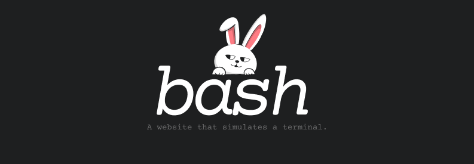

 

# About
A website that simulates the functionality of a terminal with features for fetching images, chatting, and more.

# Features
- minimalistic design
- many commands
- themes
- and much more

## APIs Used:
- developers.thecatapi.com

- blockchain.info/ticker

- jokeapi.dev

- api.waifu.pics

## Bug report or Feature request
If you encounter a bug or have a feature request, [send me an email](mailto:marcusrangelcoelho@gmail.com) or [create an issue](https://github.com/coelhomarcus/marcusbash/issues).

### Thank you!
